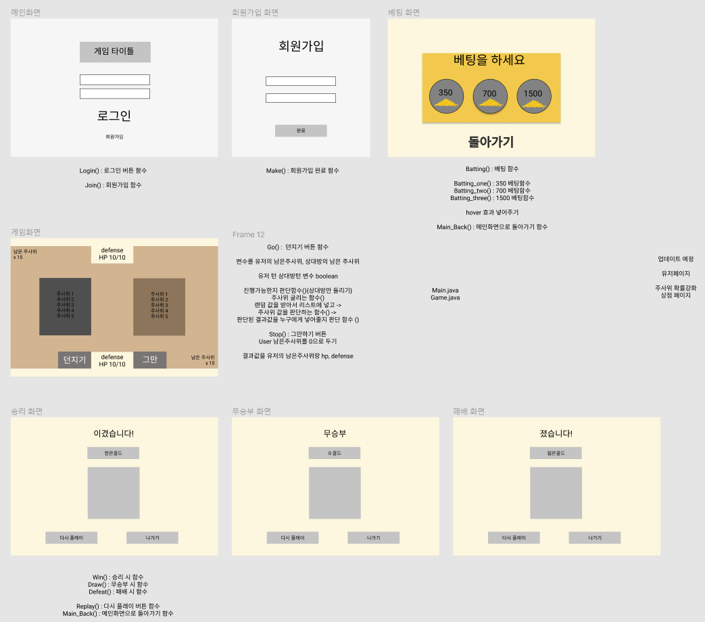

# 첫 자바 프로젝트

국비학원에 오면서 제일 원했던 팀 프로젝트를 수업 진행 한달만에 진행을 하게 되었다. 처음 진행하게된 만큼 시작을 어떻게하고 세팅을 어떻게 해야 할지 고민이 많이 하였던 부분이다.

### 주제선정

미니 프로젝트지만 첫번째로 하는 팀 프로젝트인 만큼 프로젝트의 결과물은 간단하더라도 과정은 계획적으로 진행됬으면 하였다.

첫번째 토의를 진행을 했을 때 여러 주제들이 있었지만, JAVA를 배우면서 일반적인 웹사이트처럼 구성하는 방식의 프로젝트는 배운 내용을 잘 사용하지 않을 것 같아 미니 게임을 만들고자하였다.

처음 코딩을 진행한다면 게임으로 하는게 재밌고 다양한 방식의 코드를 사용할 수 있다 생각한다.

그리고 주제를 새로운 게임으로 생각하기보다 기존에 있는 게임을 보고 분석하여 어떻게 코딩할지를 고민하고 제작하는 과정이 더욱 중요하다고 생각하여 클론 코딩을 진행하였다.

그렇게 정한 클론 게임 `WARRIORS - Rise to GLORY`

<figcaption>워리어스 게임에 나온 미니게임인 주사위 게임을 만들어보자.</figcaption>



<figcaption>플레이 영상</figcaption>

### 스토리보드 부분

스토리 보드는 [Figma](https://www.figma.com/)를 사용하기로 했다.
일단 웹으로 디자인을 할 수 있었고 무료는 2명까지 밖에 협업해서 작업하지 못하지만, 서로 다른 곳에서 복사 붙여넣기가 가능하기에 간단하게하기 편리해 보였다.

현재 스토리 보드 : [JAVA GAME](https://www.figma.com/file/xjPY1vzyXr9hXG519f0e01/JAVA-GAME?node-id=0%3A1)

일단 스토리보드는 프로젝트를 진행하면서 더 추가 해야겠다.

### 버전관리 부분

3인이서 협업으로 진행을 하기 때문에 역시 GIT을 사용 하기로 했다.
다만 이때까지 프로젝트나 공부를 혼자 해왔기에 GIT Branch를 사용 해본 적이 없기에 팀원들 끼리 따로 공부를 하여 사용을 해보기로 하였다.

[branch 설명](https://backlog.com/git-tutorial/kr/stepup/stepup1_1.html)

### 문서 부분

Notion을 사용 하기로 하였다. 원래 부터도 가끔식 문서 정리할 때 노션을 사용하기도 했고 협업으로 문서를 정리하기도 편리하기때문에 선택하였다.

노션 : [Java 작업목록](https://www.notion.so/8c6d4d6de7114911a2fc616e3868dfde?v=6168762095974f3dad9abf7e7ac7a7c8)

노션에서 그날한 작업, 검색한 자료, 예정사항 (함수 설계, DB 작업 등)을 적어두고자한다.
개인용 블로그에 그날 작업이나 문서정리가 가능하지만 개인용이기 때문에 노션이 더 편리할 것 같았다.

### 마무리

이번 첫 자바 프로젝트는 팀에서 혼자 전공자기도하고 첫 협업을 해보는 거라 무작정 코드만 짜는 것이 아니라 협업을 하는 방법에 대해 구체적으로 생각하고 진행하는 과정을 가지고자한다.

이렇게 해서 스토리보드 `Figma` 버전관리툴 `GIT` 문서작업 `Notion`을 사용해서 첫 진행을 시작한다!

화이팅하자!
