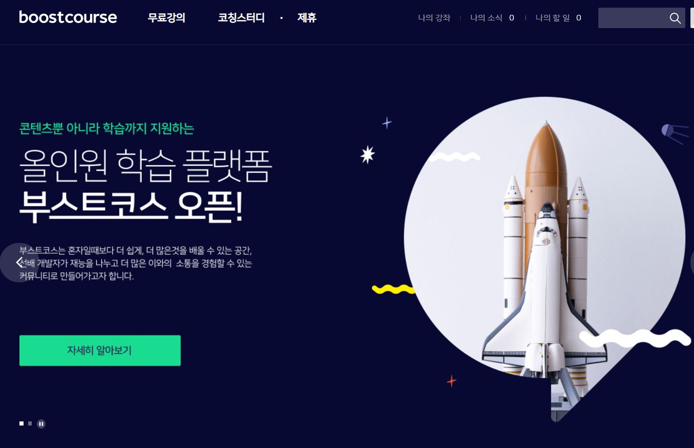
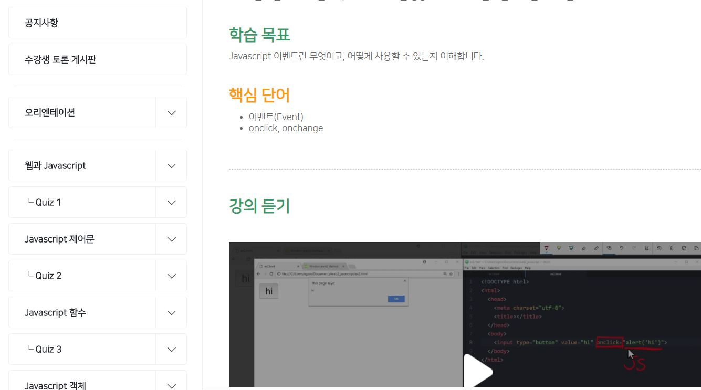

# 계기

국비 교육은 듣고 블로그에 복습겸 글도 쓰고 있다보니 6개월 동안 해야할 분량이 엄청 많아진 것 같다...
그래서 일단 프론트엔드쪽에서 쓰이는 언어를 한번 확실하게 훑고 넘어가고자 하는데 어디서 부터 시작해야될 지 막막해서 열심히 검색을 해보았다.

# POWER 검색 시작

일단 여러가지 공부를 할 수 있는 사이트가 있다. 그 중에서 2개를 추렸었는데.

1. [인프런](https://www.inflearn.com/)
   - 자주 애용하는 사이트이기도 하고 젤 처음 부터 생각이 났었다.
2. [생활코딩](https://www.opentutorials.org/course/1223)
   - 코딩 공부하면 자주 언급되던 사이트! 공부할 거리를 찾다보면 언젠가 한번 봤을 그 사이트!

빠르게 학습하고 가려면 글로 정리도 되있는 생활코딩이 좋을 것 같아. 그렇게 방향을 잡았다.

# 부스트코스 발견!

집에서 정리를 하려고 밤에 컴퓨터를 틀었는데 광고가 딱 있었다 [네이버 부스트 코스](https://www.boostcourse.org/)를 들어가보니.
아 예전에 봤던 사이트인데 깜빡하고 있었다... 헐

{: width="100%" height="100%"}

<figcaption>깔끔한 메인 페이지 화면</figcaption>

# 이 집 학습방법은?

일단 엄청 깔끔하다. 그리고 Quiz가 있고 제일 좋은게 글로도 설명 해준다는 것이다.
사실 복습용이라 동영상을 길게 시청하고 그러기가 좀 그랬는데, 글로도 설명이 되어있어서 글을 쓱 훓고 이해가 안될때만 동영상으로 확인하면 좋아보였다.

{: width="100%" height="100%"}

<figcaption>Quiz가 있는 것도 신의 한수!</figcaption>

그리고 웹관련 공부를 다하면 이제 풀스택 강좌가 따로있는데 이 수업을 들으면 참 좋아보인다.

# 마무리

이렇게 다 듣고나면 [프로그래머스](https://programmers.co.kr/)에 실력체크 - 연습과제에 들어가면 2020 Dev-Matching: 웹 프론트엔드 개발자(상반기)' 기출문제인 프론트엔드 과제가 마련되어있는데 이걸 풀고 2021년에도 진행하는걸 보니깐 2021년도 문제도 아마 올려주지않을까 생각해본다.

나오면 그것도 풀어봐야지.

아직 갈길이 먼것 같은데.. 이렇게 할 껄 정리해두니깐 그래도 목표의식은 생기는거 같아서 좋다.
