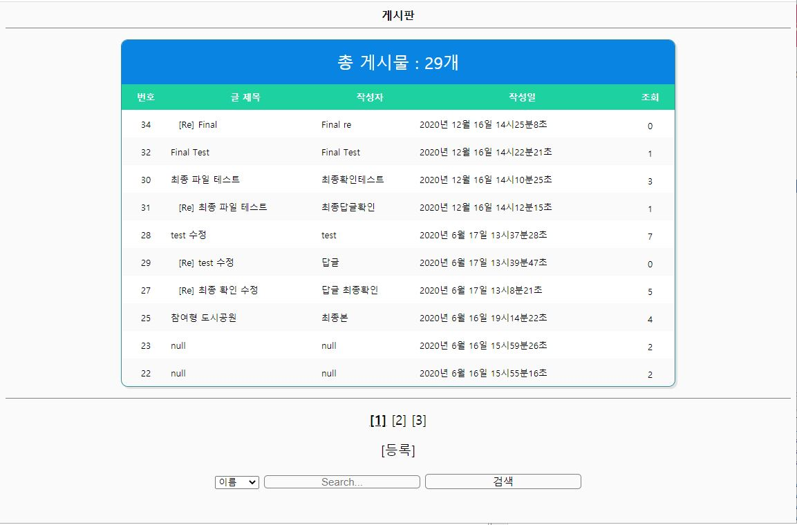
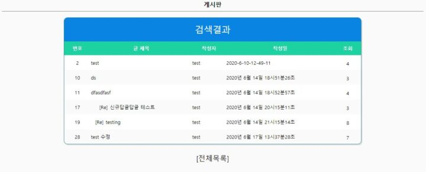
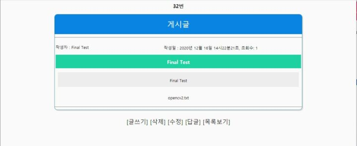
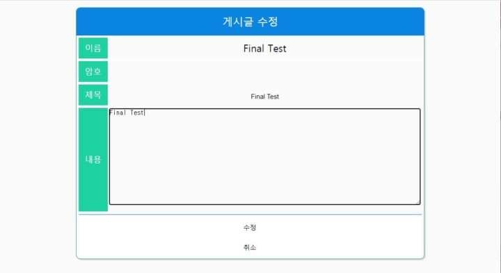
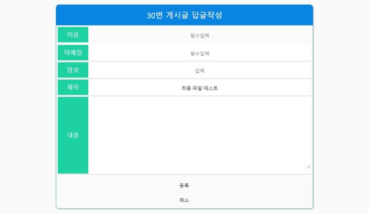

> JSP 공부

# Overview

JSP 수업을 들으며 DB와 연동하여 게시판을 구성해보았다.
Tomcat과 netbeans를 사용하여 Local로 구성하였습니다.

### 구성

게시글 작성, 읽기, 수정, 삭제 기능과 더불어 페이지징 처리, 검색, 답글달기 기능을 구현하였다.

<figcaption>게시글 화면</figcaption>

<figcaption>게시글 검색</figcaption>

<figcaption>게시글 보기</figcaption>

<figcaption>게시글 수정</figcaption>

<figcaption>게시글 답글</figcaption>

> 파일 등록 기능도 따로 추가가 되어있다.

깃허브 : [Minboard](https://github.com/mc1128/MinBoard)
