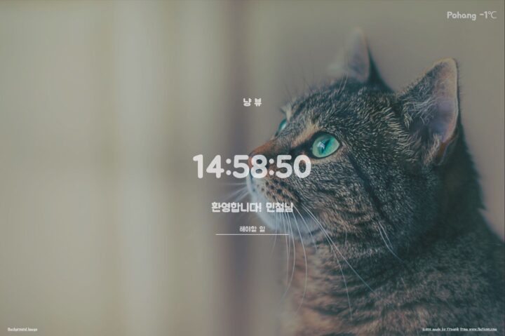

> Vanilla JS 공부

# Overview

[노마드코더 크롬 앱](https://nomadcoders.co/javascript-for-beginners) 수업을 들으며 전에 웨일 새탭 메뉴에서 고양이사진으로 새탭이 열리는 페이지가 있었는데 업데이트를 안해줘 한번 만들어 보고자 진행을 하였다.

### 구성

메인화면에서 시간과 사용자 입력, ToDo 리스트를 포함하며 위치를 받아드려 그날의 온도를 표시해주는 방식을 생각하였다.

<figcaption>구성이 잘된 모습을 볼 수 있다.</figcaption>

### 업데이트

현재는 업데이트를 못하고있지만, 첫번째로 버전을 올릴 때에는 사진 추가 및 사용자 이름을 누르면 화면에서 보이지 않게 하기 위해 css의 display 값을 사용하여 숨김을 할 수 있게 해주었다.
조금 더 업데이트를 해주고 싶은데... 정말 아쉽다 나중에 날 잡고 한번 업데이트를 해야겠다.

# 마치며

네이버 웨일에 확장앱을 올리고 정말 사용하는 사람의 리뷰를 받고 의견을 보니 개발하는 사람으로써 엄청 뿌듯함을 느꼇다. 이 마음을 유지하고 싶다.
