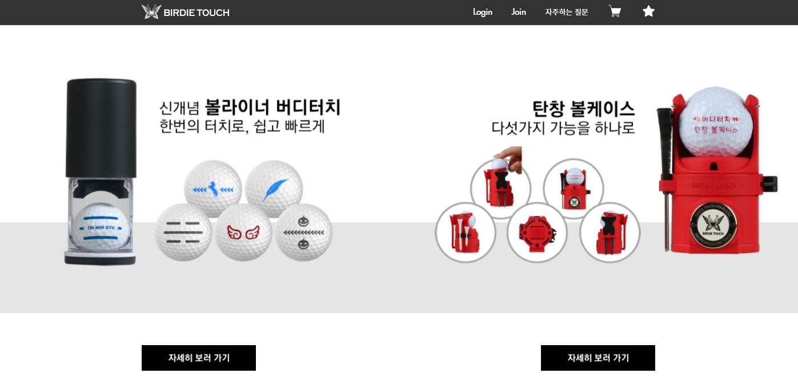

> 웹에 관심이 더 가게된 작업.

# Overview

[버디터치](www.birdietouch.com)에서 새로운 상품을 판매하기 위한 새 상품 페이지가 필요했고 볼케이스 구매 및 결제까지 가능 하도록 작업해야했다.

# 작업

### 사이트 파악

사이트 자체는 영카트를 이용하여 만들어졌지만, 기본 디자인은 영카트와 다르게 작성되었으며, 또한 사이트를 받고 파일을 찾아보니 사용되지않는 파일들과 복잡하게 파일들이 연결되어있었는데,

무슨 일인가 하니 사이트를 한번 만들다가 엎어져서 다른 팀에서 새롭게 맡아 작업된 것이였다.

사이트를 전체적으로 개편하지않고 페이치추가와 메인페이지만 바꾸면되기에 일단 작업을 진행하였다.

### 상품 페이지 추가

기존에 있던 상품페이지와 유사하게 작업을 받았기에 html, css 레이아웃을 비슷하게 작성하면 되었으며, 사이트 내의 유튜브 영상, 이미지 스위프트, 영카트 페이지의 DB에 볼케이스를 넣어 색상을 클릭하면 선택한 색상의 볼케이스가 나오도록 JS를 작성하였다.

{: width="70%" height="70%"}

<figcaption>색상을 누르면 색이 바뀌고 다른색상이 추가가 가능하다. 처음에 JS는 맞는데 색상이 안바뀌어 PHP파일이 어떻게 연결되있는지 찾는냐 애를 먹었다.</figcaption>

### DB연결

결제까지 진행이 되기 위해서는 고른 색상의 볼케이스가 장바구니 및 결제를 했을 때 관리자 페이지로 넘어가는 부분까지 고려해야 했기에 DB 작업을 했다.

### 메인페이지 추가

원래는 볼라이너부분이 나오고 연결되게 메인페이지를 구성하였는데, 볼라이너와 볼케이스부분을 화면에 반으로 가르고 버튼을 넣어 연결되게끔 작업을 부탁받았다.

{: width="100%" height="100%"}

<figcaption>메인페이지 화면</figcaption>

### 호환성 확인

작업을 마치고 검토를 받는데 버튼이 hover를 사용하여서 마우스를 올리면 색상이 변하도록 바꿔었는데, 안된다고 연락을 받았다.
알고보니 explore에서는 a 태그를 순서대로 작성해야 제대로 동작을 한다고 한다.
(~~까탈스러운 녀석이다~~)

### 그 밖의 문제

판매내역창을 띄울때 상품 명이나 가격표기 오류나 이미지 출력 부분같은 사소한 오류들을 수정하고 작업을 마무리를 할 수 있었다.

# 마치며

처음으로 실제로 사용되는 사이트를 작업할 수 있는 경험을 얻을 수 있어서 굉장히 큰 도움이라고 생각되는 작업이였다. 사이트의 흐름이나 서로의 관계를 볼 수 있었고 실제로 결제가 어떻게 진행되는지 알 수 있었다.
